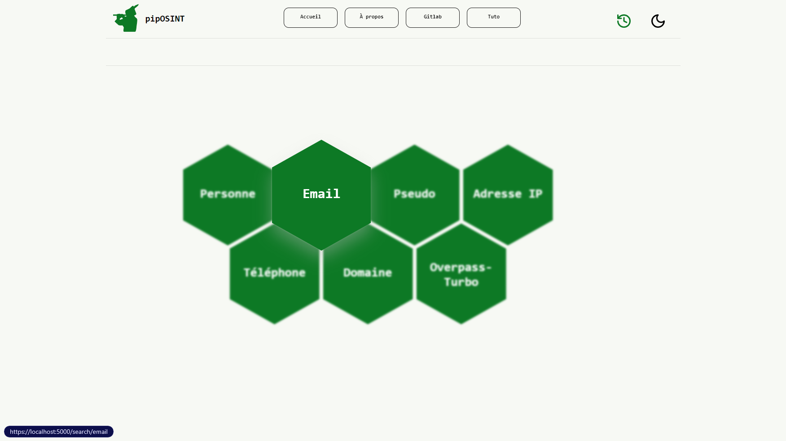
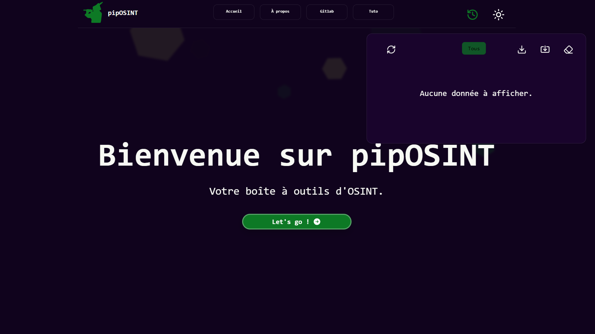

# pipOSINT

## Introduction
Ceci est le dépôt Gitlab de notre projet de BSI : pipOSINT, conduit durant l'année 2023-2024.
Le projet est dirigé par :

- [Prezident](https://github.com/PrezidentB)
- [ArKoo](https://github.com/arkokoo)
- [Ectolast](https://github.com/mathysv)

Ce projet consiste en une boîte à outils d'OSINT conteneurisée accessible via une interface web ou une API.
Il embarque de nombreux outils englobant divers domaines :
- **Nom/Prénom** : Genderize.io, Nationalize.io, Webmii et quelques Google Dorks.
- **Email** : Holehe
- **Pseudo** : Blackbird
- **Adresse IP** : IP-API
- **Numéro de téléphone** : Phonenumbers, Tellows et Spamcalls
- **Nom de domaine** : Hunter
- **GEOINT** : Overpass-Turbo

## Arborescence
- `docker-compose.yml` : Installe l'environnement complet de l'outil
- `backend/` : Code du backend
  - `.env` : Fichier d'inventaire (à configurer avant lancement des conteneurs)
  - `run.py` : Fonction principale du backend
  - `history/` : Dossier contenant les json des requêtes effectuées.
  - `app/` : Répertoire de l'API
    - `routes/` : Routes de l'API
    - `services/` : Fonctions spécifiques aux routes
    - `utils/` : Fonctions générales
- `frontend/` : Code du frontend
- `overpass-turbo/` : Code du service overpass-turbo
- `nginx/` : Config du conteneur nginx
  - `app/` : Patch d'intégration à la solution

## Installation

Renseigner la clé d'API de Hunter (gratuite ou payante) pour le service "Domaine" dans le fichier `backend/.env`.

Déployer les conteneurs :
```bash
sudo docker-compose up -d --build
```

Désormais, le service web est accessible sur `https://votre-ip:5000`.
L'API est rendue accessible depuis la route `/api/` et le service overpass-turbo sur `/services/overpass-turbo/`.

## Stack technique

### Frontend
- VueJS 3
- Vite
- ChartJS (Diagrammes)
- Lucide (librairie graphique)

### Backend
- Flask
- Gunicorn

## Previews



